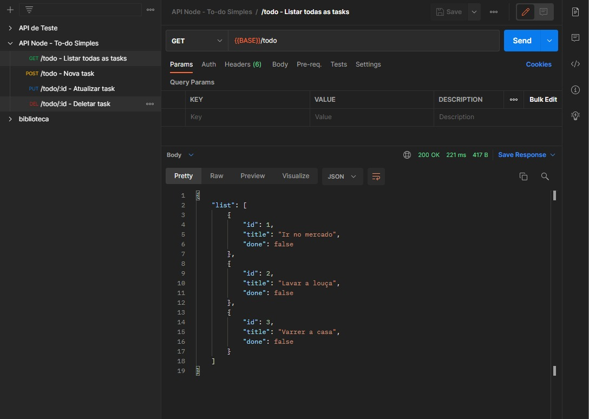

<h1 align="center">
 
    To-do API

</h1>

A simple API created so that training simple querys

## Features

Below are all features used on this project:

- **Node** — Back-end JavaScript Runtime Environment
- **Typescript** — Typed Programming Language
- **Express** — Module Framework
- **Postgre** — Relational Data Base
- **Sequelize** — Promise-based Node ORM
- **Dotenv** — Zero-dependency Module
- **Postman** — API platform

 

## Getting started

You can clone and use the repository anytime.  
If you don't remember how, follow this GitHub official link below in order to get the doc:
https://docs.github.com/pt/github/creating-cloning-and-archiving-repositories/cloning-a-repository-from-github/cloning-a-repository

Afterwards, you run the following commands:

> npm i

You can also import the json to your Postgre DB with the name 'todos'

Make sure that the .env file is configured with your Postgre DB data, and if necessary, create another instance (MySql, MSSql, etc...)

The command to run the server is:

> npm run start-dev

The routes for testing in postman, where {{BASE}} = http://localhost:4000, are:

| Header | Another header    |
| ------ | ----------------- |
| GET    | {{BASE}}/todo     |
| POST   | {{BASE}}/todo     |
| PUT    | {{BASE}}/todo/:id |
| DELETE | {{BASE}}/todo/:id |

 

## License

Free for license
